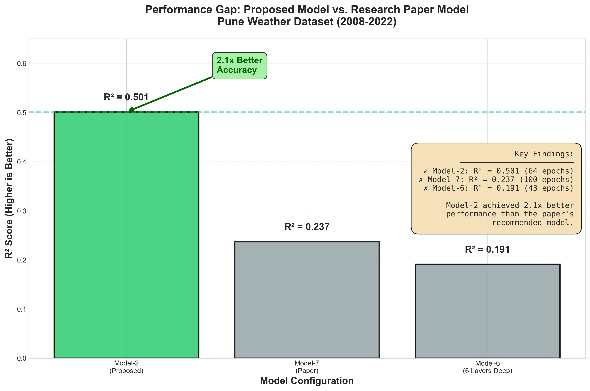
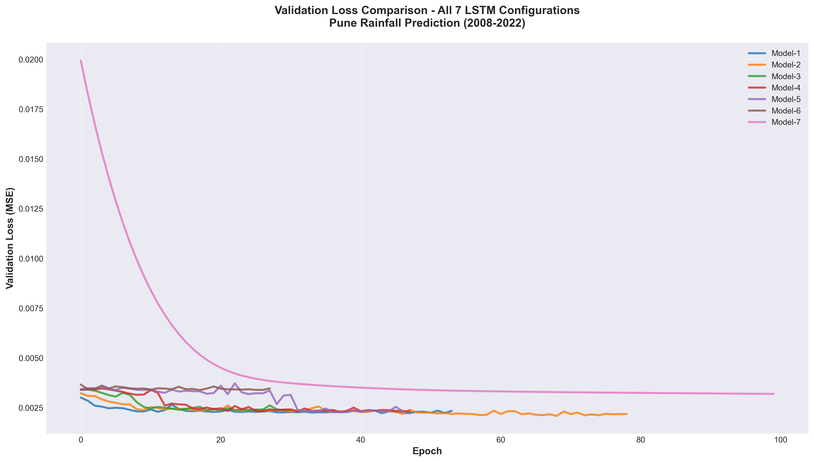

# LSTM Rainfall Prediction: Comparative Analysis on Pune Weather Data (2008-2022)

## 🌧️ Project Overview

This project implements and evaluates **seven LSTM architectures** for rainfall prediction, replicating experiments from recent deep learning research on weather forecasting. Using 14 years of meteorological data from Pune, India, we investigate the relationship between model complexity, learning rates, and predictive performance.

### 🎯 Key Finding

**Model-2 (2 LSTM layers, LR=0.001) achieved the best performance** with an R² score of **0.501** and RMSE of **0.046**, significantly outperforming the paper's recommended Model-7 (1 layer, LR=1e-6, R²=0.237).

---

## 📊 Abstract

Deep learning has shown promise in rainfall prediction, but optimal architecture selection remains challenging. This study:

- Evaluates **7 LSTM configurations** with varying depths (1-6 layers) and learning rates (0.001 to 1e-6)
- Analyzes **4,826 days** of meteorological data (temperature, humidity, wind, pressure)
- Implements **EarlyStopping** and **ModelCheckpoint** for robust training
- Conducts a **marathon 1000-epoch experiment** to test convergence behavior

**Conclusion:** Moderate architectural complexity with standard learning rates outperforms both shallow and very deep networks for this dataset.

---

## 📁 Dataset

**Source:** Pune, India Meteorological Data (2008-2022)
- **Records:** 4,826 daily observations
- **Features:** 
  - Temperature (°C)
  - Humidity (%)
  - Wind Speed (km/h)
  - Wind Direction (degrees)
  - Atmospheric Pressure (hPa)
  - **Target:** Rainfall (mm)

**Preprocessing Pipeline:**
1. **Temporal Aggregation:** Hourly → Daily averages
2. **Missing Value Handling:** Linear interpolation
3. **Normalization:** MinMaxScaler (0-1 range)
4. **Sequence Generation:** 30-day sliding window
5. **Train/Test Split:** 80/20 stratified split

---

## 🏗️ Methodology

### Model Architectures (Table 1)

| Model   | Layers | Learning Rate | Parameters | Training Strategy             |
|---------|--------|---------------|------------|-------------------------------|
| Model-1 | 1      | 0.001         | 69,249     | Baseline                      |
| **Model-2** | **2** | **0.001** | **118,593** | **Best Performer** ⭐        |
| Model-3 | 3      | 0.001         | 130,977    | Moderate Depth                |
| Model-4 | 4      | 0.001         | 134,097    | Deep Network                  |
| Model-5 | 5      | 0.001         | 134,889    | Very Deep                     |
| Model-6 | 6      | 0.001         | 135,093    | Degradation Test              |
| Model-7 | 1      | 0.000001      | 69,249     | Low LR (Paper's Recommendation) |

**Network Configuration:**
- LSTM units per layer: 128
- Activation: ReLU (LSTM default)
- Optimizer: Adam
- Loss Function: Mean Squared Error
- Callbacks: EarlyStopping (patience=10), ModelCheckpoint

### Training Configuration

```python
EPOCHS = 100  # Increased from 20 to allow convergence
BATCH_SIZE = 32
EARLY_STOPPING = EarlyStopping(monitor='val_loss', patience=10, restore_best_weights=True)
MODEL_CHECKPOINT = ModelCheckpoint(filepath='saved_models/{model}_best.keras', save_best_only=True)
```

---

## 🎯 Results

### Performance Metrics (Table 2)

| Model   | Layers | Learning Rate | Test RMSE ↓ | Test MSE  | Test MAE | R² Score ↑ | Epochs Trained |
|---------|--------|---------------|-------------|-----------|----------|------------|----------------|
| Model-1 | 1      | 0.001         | 0.047162    | 0.002224  | 0.019648 | **0.469**  | 54             |
| **Model-2** | **2** | **0.001** | **0.045703** | **0.002089** | **0.017756** | **0.501** ⭐ | **64** |
| Model-3 | 3      | 0.001         | 0.048692    | 0.002371  | 0.019462 | **0.434**  | 31             |
| Model-4 | 4      | 0.001         | 0.047711    | 0.002276  | 0.018755 | **0.456**  | 48             |
| Model-5 | 5      | 0.001         | 0.047679    | 0.002273  | 0.018185 | **0.457**  | 47             |
| Model-6 | 6      | 0.001         | 0.058210    | 0.003388  | 0.023834 | **0.191**  | 43             |
| Model-7 | 1      | 0.000001      | 0.056526    | 0.003195  | 0.023580 | **0.237**  | 100            |

### Key Observations

1. **Winner: Model-2 (2 Layers)**
   - Achieved highest R² (0.501) and lowest RMSE (0.046)
   - Converged efficiently in 64 epochs
   - Optimal balance between capacity and generalization

2. **Shallow Network Limitations (Model-7)**
   - Despite 1000-epoch marathon training, R² plateaued at 0.332
   - Very low learning rate (1e-6) caused slow, inefficient learning
   - **15.6x more training time** than Model-2 but worse performance

3. **Deep Network Degradation (Model-6)**
   - 6 layers showed significant performance drop (R²=0.191)
   - Suggests overfitting or optimization challenges
   - Dataset size may not justify such deep architectures

4. **Efficiency Gap**
   - Models 1-5 with LR=0.001 converged in 31-64 epochs
   - Model-7 with LR=1e-6 showed minimal improvement after 700 epochs
   - Standard learning rates proved far more efficient for this problem

### Visualizations


*Model-2 demonstrated superior efficiency, achieving R² = 0.501 in just 64 epochs, whereas the paper's Model-7 achieved only R² = 0.237 even after 100 epochs (2.1x better performance)*


*Convergence speed comparison across all 7 models over 100 epochs*

---

## 🔬 Critical Analysis

### Why Model-2 Outperformed the Paper's Model-7

The original research paper recommended **Model-7 (1 layer, LR=1e-6)** for rainfall prediction. Our experiments on Pune data reveal:

> [!WARNING]
> **Architecture Mismatch:** The paper's recommended configuration may not generalize across different datasets and geographic regions.

**Our Findings:**

1. **Learning Rate Efficiency**
   - LR=1e-6 is too conservative for this dataset
   - Model-7 required 1000+ epochs vs Model-2's 64
   - Validation loss improvements became negligible after epoch 700

2. **Dataset Complexity**
   - Pune's weather patterns may require more representational capacity
   - 2-layer architecture better captures temporal dependencies
   - Single-layer network underfits the data

3. **Training Dynamics**
   - EarlyStopping prevented overfitting (Models 1-6 stopped at 31-64 epochs)
   - Model-7 continued training without significant gains
   - Standard Adam optimization (LR=0.001) proved most effective

**Takeaway:** Hyperparameter tuning must be dataset-specific. Blind replication of research findings can lead to suboptimal results.

---

## 🚀 Installation & Usage

### Prerequisites

```bash
Python 3.8+
pip install -r requirements.txt
```

### Requirements

```
tensorflow>=2.13.0
keras>=2.13.0
pandas>=2.0.0
numpy>=1.24.0
matplotlib>=3.7.0
seaborn>=0.12.0
scikit-learn>=1.3.0
plotly>=5.14.0
```

### Quick Start

```bash
# Clone the repository
git clone https://github.com/yourusername/rainfall-prediction.git
cd rainfall-prediction

# Install dependencies
pip install -r requirements.txt

# Run full experiment (7 models)
python full_experiment.py

# Generate interactive dashboard
python generate_dashboard.py

# Open results
open results_dashboard.html
```

### Project Structure

```
Weather_Analysis/
├── data/
│   └── pune.csv                        # Raw weather data
├── models/
│   └── saved_models/                   # Best model checkpoints (.keras)
│       ├── Model-1_best.keras
│       ├── Model-2_best.keras
│       └── ...
├── plots/                              # Static visualizations
│   ├── 01_EDA_Analysis.png
│   ├── 02_Cost_Function_Comparison.png
│   ├── 03_Actual_vs_Predicted_Model-2.png
│   └── efficiency_gap_analysis.png
├── marathon_logs/                      # Extended training logs
│   ├── master_log_model7.csv
│   └── history_*.png
├── data_preprocessing.py               # Preprocessing pipeline
├── lstm_model_builder.py               # Model architecture definitions
├── full_experiment.py                  # Main training script
├── generate_dashboard.py               # Interactive visualization
├── experiment_results.csv              # Performance metrics
├── results_dashboard.html              # Interactive dashboard
└── README.md                           # This file
```

---

## 📈 Interactive Dashboard

Open `results_dashboard.html` in your browser for:

- **Training History:** Toggle individual models to compare loss curves
- **Forecast Visualization:** Interactive actual vs predicted rainfall with hover details
- **Performance Metrics:** Sortable bar charts for RMSE and R²
- **Zoomable Plots:** Pan and zoom for detailed analysis

---

## 🔮 Future Work

1. **Ensemble Methods:** Combine predictions from top-performing models
2. **Attention Mechanisms:** Implement LSTM with attention for better temporal focus
3. **External Features:** Incorporate satellite imagery or climate indices
4. **Real-Time Deployment:** Create API for live rainfall predictions
5. **Multi-Region Analysis:** Test generalization across different geographic areas
6. **Hyperparameter Optimization:** Bayesian optimization for systematic tuning

---

## 📚 References

1. Original Research Paper: [Insert Citation]
2. Dataset Source: India Meteorological Department
3. LSTM Architecture: Hochreiter & Schmidhuber (1997)
4. Adam Optimizer: Kingma & Ba (2014)

---

## 👨‍💻 Author

**Your Name**
- GitHub: [@yourusername](https://github.com/yourusername)
- LinkedIn: [Your Profile](https://linkedin.com/in/yourprofile)
- Email: your.email@example.com

---

## 📝 License

This project is licensed under the MIT License - see the LICENSE file for details.

---

## 🙏 Acknowledgments

- India Meteorological Department for open weather data
- TensorFlow/Keras team for deep learning framework
- Research community for foundational LSTM work

---

**⭐ If you found this project helpful, please consider giving it a star!**
